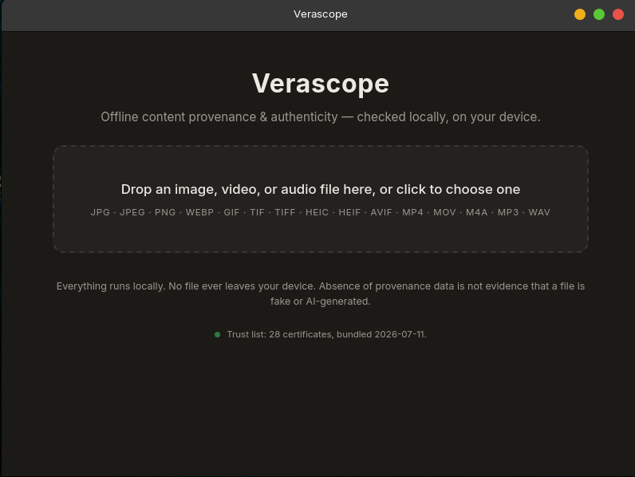
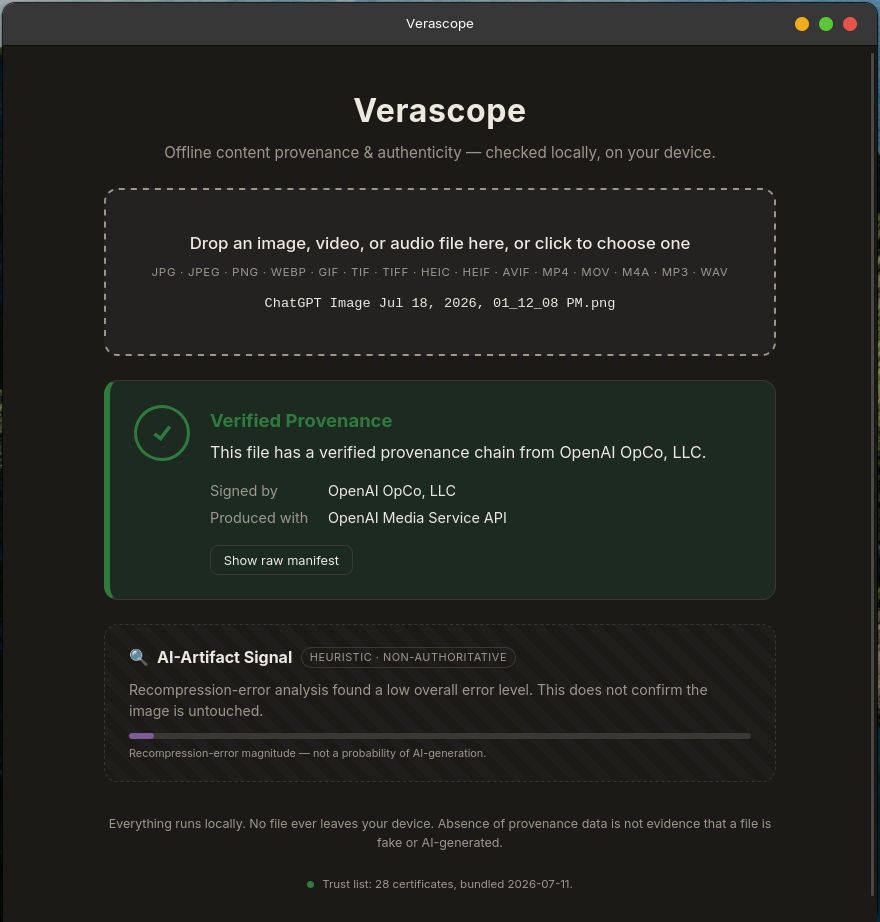
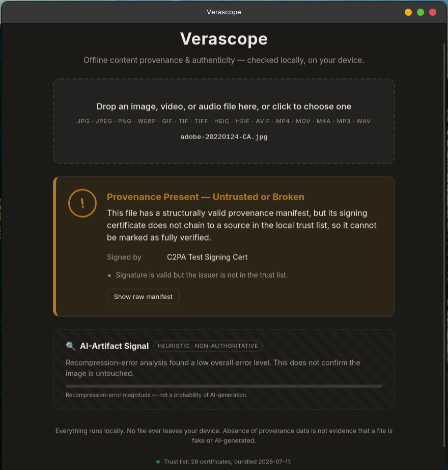
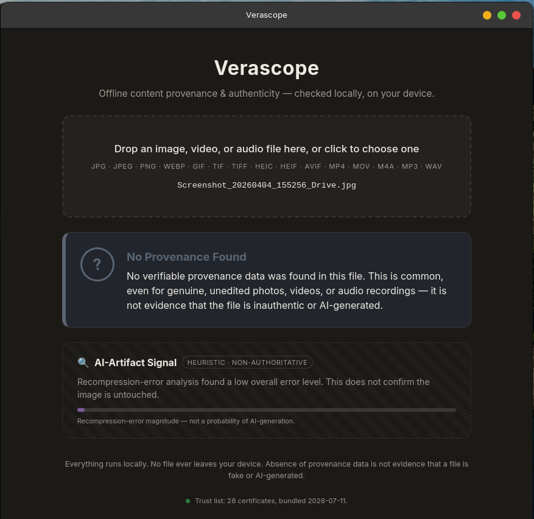

<div align="center">


# Verascope

**Offline C2PA provenance verifier — cryptographic content authenticity, checked locally on your device.**

[](https://github.com/Faizan-Shurjeel/Verascope/releases/latest)
[](https://github.com/Faizan-Shurjeel/Verascope/releases)
[](#license)
[](https://github.com/Faizan-Shurjeel/Verascope/stargazers)




*Drop a file. Get a cryptographic answer — not a guess. No file ever leaves your device.*

</div>

---

## Why

AI-generated and manipulated media is everywhere, and "detector" websites that upload your files to a server and answer with a fake-confidence percentage are the wrong tool. [C2PA](https://c2pa.org) (the standard behind *Content Credentials*, backed by Adobe, Microsoft, OpenAI, Google, Sony, Leica and others) embeds cryptographically signed provenance directly in media files. Verascope reads and validates those signatures **entirely offline** — the same way you'd verify a document's signature, not the way you'd ask a magic 8-ball.

## The three-state verdict

Verascope never gives a binary "real/fake" answer. Every file resolves to one of three states:

|  | State | Meaning |
|---|---|---|
| 🟢 | **Verified** | Manifest present, signature valid, and it chains to a trusted authority in the bundled trust list. |
| 🟠 | **Untrusted or Broken** | A manifest exists but failed validation — bad signature, tampered content, or an untrusted signer. |
| 🔵 | **No Provenance** | No manifest found. This is **not** evidence of anything — most genuine photos have no manifest. |

### Verified — e.g. a ChatGPT-generated image, signed by OpenAI

<div align="center"></div>

### Untrusted or Broken — manifest present, but the signer isn't trusted

<div align="center"></div>

### No Provenance — a plain screenshot, and that's fine

<div align="center"></div>

## The heuristic panel — deliberately separate

A secondary, clearly labeled **non-authoritative** panel shows an Error Level Analysis signal (recompression-artifact magnitude, images only). Cryptographic provenance and heuristic guessing are two different problems, and Verascope's UI never blends them — the heuristic can't upgrade or downgrade a verdict, and its copy never claims to detect AI.

> **Note:** the heuristic decodes common formats only — HEIC/HEIF (typical iPhone photos) can't be decoded for pixel analysis, so no heuristic signal is shown for them. The C2PA verdict is unaffected.

## Install

Grab the installer for your OS from the **[latest release](https://github.com/Faizan-Shurjeel/Verascope/releases/latest)**:

| OS | Package |
|---|---|
| Windows | `.msi` installer or `.exe` setup |
| macOS | `.dmg` (Apple Silicon & Intel builds) |
| Linux | `.deb`, `.rpm`, or portable `.AppImage` |

> Builds are currently unsigned — Windows SmartScreen / macOS Gatekeeper will ask you to confirm on first launch.

## Privacy by architecture

- **Zero network calls.** The `c2pa` crate is compiled with its HTTP backends disabled — remote fetching isn't just switched off, it isn't compiled in.
- **The trust list ships inside the binary.** The official C2PA trust list is embedded at build time (`src-tauri/trust-list/`), so validation is fully offline. The app displays the list's bundled date and flags it when stale; updating is an explicit, versioned rebuild — never a silent background fetch.
- **Files are read, never executed, never uploaded.**

## Develop

Requires **Rust 1.88+** (the `c2pa` crate needs it — a distro `apt install rustc` is usually too old; use [rustup](https://rustup.rs), which reads the bundled `rust-toolchain.toml`), [Bun](https://bun.sh), and the [Tauri v2 system deps](https://tauri.app/start/prerequisites/).

```bash
bun install
bun run tauri dev      # run the full app (primary dev loop)
bun run build          # typecheck + build frontend
bun run tauri build    # native installers
```

## Status & roadmap

Phase 1 (C2PA verification, images), Phase 2 (heuristic panel), and Phase 3 (video/audio) are functional. Next up: calibrating the heuristic against a labelled corpus, test coverage, and community building. See [`docs/PROJECT.md`](docs/PROJECT.md) for the full scope, design principles, and phased roadmap.

## Contributing

Contributions are very welcome — this project is actively looking for contributors and co-maintainers. See [`CONTRIBUTING.md`](CONTRIBUTING.md) and the [Code of Conduct](CODE_OF_CONDUCT.md). Good entry points: test coverage, heuristic calibration, trust-list tooling, and UI polish.

## Star history

<a href="https://www.star-history.com/?repos=Faizan-Shurjeel%2FVerascope&type=date&legend=top-left">
 <picture>
   <source media="(prefers-color-scheme: dark)" srcset="https://api.star-history.com/chart?repos=Faizan-Shurjeel/Verascope&type=date&theme=dark&legend=top-left&sealed_token=kGzznC4DAnH_Whmt0TdkiEHULKNg2JQThBUaB71gCVSfrYXFXofpfQoOUBmXVxmA3icIz4uLRPIEsbylGw2nerPNxq0dhxQSMbi8XK_wBuc7lDFbB9sL8KCsLfeu3HA_widyUZsQZ1PWU1IUYKzfjyUE8oe5L4OFcuMm16NBDSwB8oZ6zpRTWaCOjh9V" />
   <source media="(prefers-color-scheme: light)" srcset="https://api.star-history.com/chart?repos=Faizan-Shurjeel/Verascope&type=date&legend=top-left&sealed_token=kGzznC4DAnH_Whmt0TdkiEHULKNg2JQThBUaB71gCVSfrYXFXofpfQoOUBmXVxmA3icIz4uLRPIEsbylGw2nerPNxq0dhxQSMbi8XK_wBuc7lDFbB9sL8KCsLfeu3HA_widyUZsQZ1PWU1IUYKzfjyUE8oe5L4OFcuMm16NBDSwB8oZ6zpRTWaCOjh9V" />
   
 </picture>
</a>

## License

Licensed under either of [MIT](LICENSE-MIT) or [Apache-2.0](LICENSE-APACHE) at your option.
